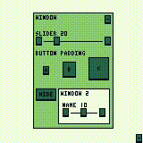

# UI Library for WASM-4 (AssemblyScript)

This library provides a simple and efficient way to create basic UI components for [WASM-4](https://wasm4.org/) projects using AssemblyScript. It includes support for mouse handling and UI elements such as text rendering, buttons and sliders. 

<p align="center">
  
</p>

## Table of Contents

- [Getting Started](#getting-started)
  - [Installation](#installation)
- [Usage](#usage)
   - [Mouse Input](#mouse-input)
   - [UIElement](#uielement)
   - [Window](#window)
   - [Text](#text)
   - [Slider](#slider)
- [API Documentation](#api-documentation)
  - [Mouse Class](#mouse-class)
  - [UIElement Class](#uielement-class)
  - [Text Class](#text-class-extends-uielement)
  
## Getting Started

### Installation

To use this library in your WASM-4 project you can simply add `src/UI.ts` file to your project and include it in your `main.ts` file: 

```typescript
import * as UI from "./UI";
```

You can also clone this repository and setup it to check example use of UI. You can find instructions for project setup in official documentation: 
https://wasm4.org/docs/getting-started/setup

## **Usage**

### Mouse Input
   The `Mouse` class provides utilities to track the mouse's current and previous state, including its position and button states.


   ```typescript
   
   import * as UI from "./UI";

   // In your update loop
   export function update (): void {
    UI.update(); // Update for mouse state

     // *** Your code ***
   }
   ```

### UIElement
  Every UI element extends `UIElement` class. You can also make your own custom elements this way.  An example class could look like this:
   ```typescript

    export class Point extends UIElement {
    
        constructor(x: i16, y: i16) {
            super();
            this.x = x;
            this.y = y;
        }
    
        private draw(x: i16, y: i16) : void {
            // Rendering Element
            w4.hline(x, y, 1);
        }
    
        update(x: i16, y: i16) : void {
            if(this.hidden) { return; }
            x += this.x;
            y += this.y;
    
            this.draw( x, y);
    
            // Element's logic
        }
    }
   ```

### Window
  Window element is a container in which you can put any other UI element (also other windows). When window update is called, it's going to automaticaly update/render all childeren elements unless it's set as hidden. Element `x` and `y` position is relative to parent.

   ```typescript
   let window: UI.Window = new UI.Window(10, 10, 30, 30, 0x23);
   let button: UI.Button = new UI.Button( 5, 5, "Select", 3);
   
   window.append(button); // Set button as window child
   ```
   
### Text
   Text element can be use to add for example section title. You can set text as centered, but right now alignment functionality is limited. 

   ```typescript
   // Example
   let myText = new UI.Text( 0, 0, "Some text", false);
   ```
   
   You can also render text directly without creating text element: 

   ```typescript
   UI.Text.write("Some text", 0, 0, 0x23);
   ```


### Slider
   For sliders you can define value range, width and name displayed above. There are buttons for increasing and decreasing value preciesly. 
   
   ```typescript
   let slider: UI.Slider = new UI.Slider( 0, 0, "Slider name", 90, 0, 100, 50); // new UI.Slider( x, y, name, width, min, max, default value);

   export function update (): void {
    UI.update(); 
    slider.update();

    volume = slider.value;
   }
   
   ```


## API Documentation

#### Mouse Class
- `Mouse.x`: X coordinate of the mouse.
- `Mouse.y`: Y coordinate of the mouse.
- `Mouse.currentState`: Current mouse button state.
- `Mouse.previousState`: Previous mouse button state.
- `Mouse.update()`: Updates the mouse coordinates and button states.

#### UIElement Class
- `x`, `y`: Position of the element.
- `hidden`: Visibility of the element.
- `update(x: i16, y: i16)`:  Refreshes the UI element.

#### Text Class (extends UIElement)
- `text`: The string of text to be displayed.
- `centered`: Whether the text should be centered or not.
- `update(x: i16, y: i16)`: Refreshes the UI element.
